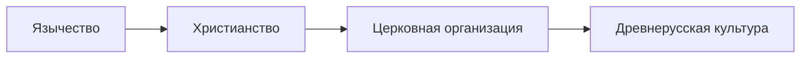

# Крещение Руси (988 г.)

## Предпосылки крещения

| Фактор        | Влияние                     |
|---------------|-----------------------------|
| Геополитика   | Связи с Византией           |
| Экономика     | Торговые пути               |
| Единство      | Объединение племен          |

> "Володимер же крестил землю Русскую от конца и до конца"  
> *Повесть временных лет*

## Основные этапы

1. **986 г.** - "Испытание вер" князем Владимиром
2. **987 г.** - Крещение Владимира в Херсонесе
3. **988 г.** - Массовое крещение киевлян в Днепре

## Последствия

- Создание церковной иерархии
- Развитие письменности (кириллица)
- Строительство первых храмов:
  - Десятинная церковь (Киев)
  - Софийский собор (Новгород)

## Историческое значение
Крещение Руси стало поворотным моментом в истории восточных славян, определившим:
- Культурное развитие
- Политическую ориентацию
- Духовные традиции