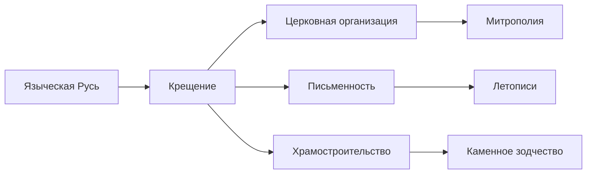

# Крещение Руси (988 г.)


## Предпосылки крещения
| Фактор         | Влияние                          |
|----------------|----------------------------------|
| Геополитический| Связи с Византией                |
| Экономический  | Торговые пути "из варяг в греки" |
| Культурный     | Письменность, архитектура       |
| Личностный     | Выбор князя Владимира            |

## Основные этапы
1. **986-987 гг.** - "Испытание вер" князем Владимиром
2. **987-988 гг.** - Крещение Владимира в Херсонесе (Корсуни)
3. **988 г.** - Массовое крещение киевлян в Днепре
4. **989-990 гг.** - Учреждение церковной иерархии
5. **991-992 гг.** - Крещение Новгорода

> "Почему бы не принять нам эту веру? Византийская вера прекрасна!"  
> *Летописное сказание о выборе веры*

## Первые митрополиты Киевские

```python
# Хронология первых предстоятелей
metropolitans = [
    {"name": "Михаил I", "years": "988-992", "achievement": "Организация церковной структуры"},
    {"name": "Леонтий", "years": "992-1008", "achievement": "Крещение Ростова"},
    {"name": "Иоанн I", "years": "1008-1035", "achievement": "Строительство соборов"},
    {"name": "Феопемпт", "years": "1035-1049", "achievement": "Освящение Софии Киевской"}
]

for m in metropolitans:
    print(f"{m['name']} ({m['years']}): {m['achievement']}")
```

## Последствия крещения

### Положительные
- Развитие письменности (кириллица)
- Строительство храмов (Десятинная церковь, София Киевская)
- Формирование единой культурной идентичности
- Смягчение нравов, ограничение кровной мести

### Отрицательные
- Утрата элементов языческой культуры
- Сопротивление крещению в отдельных регионах
- Зависимость от Константинопольского патриархата



## Историческое значение
Крещение Руси стало поворотным моментом в истории восточных славян:
- Определило цивилизационный выбор Руси
- Способствовало созданию единого государства
- Заложило основы русской культуры
- Ввело Русь в семью христианских народов

## Основные источники
1. "Повесть временных лет" (Нестор Летописец)
2. "Память и похвала князю Владимиру" Иакова Мниха
3. Византийские хроники (Лев Диакон)
4. Археологические находки в Киеве и Херсонесе